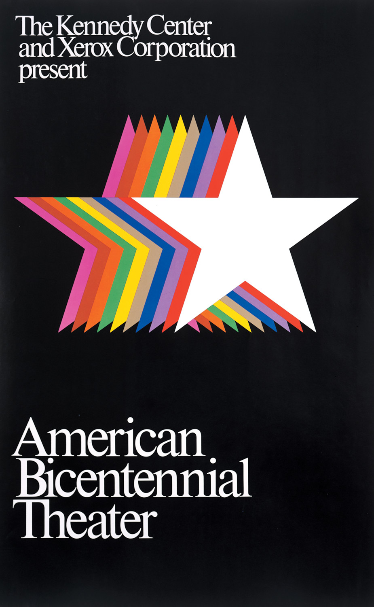

# Web-Animatie

## American Bicentennial Theater, poster 

Toen wij de opdracht kregen om een poster interactief te maken, kregen wij een aantal sites aangeboden om hier wat uit te zoeken. Het eerste wat ik deed was op de site van AIGA Design Archives zoeken naar kunstwerken uit de jaren '60 en '70. Dit zijn mijn favoriete design jaren en ik ben vooral gek op de manier waarop posters in deze tijd werden vormgegeven. 
Na heel wat pagina's gezien te hebben, viel mijn oog op de poster van het American Bicentennial Theater. 
De poster zag er op het oog erg simpel uit, maar ik wilde ook direct weten wat het verhaal achter deze poster was, voor wie dit was en door wie dit werd aangeboden.

De poster is een advertentie voor de American Bicentennial Theater. Dit was een theatergroep die het tweehonderdjarig bestaan van Amerikaanse vrijheid herdacht. Dit vond plaats in 1975. De American Bicentennial Theater werd nationaal gesponsord door de Xerox Corporation. Xerox is inmiddels een wereldwijd opererend Amerikaans bedrijf dat diensten en producten aanbiedt op het gebied van beheer en reproductie van documenten. In deze tijd was een baanbrekend voor het reproduceren van posters, in de jaren '60 werden posters vaak met de hand gemaakt. 

De poster is door Thomas Geismar gemaakt, een Amerikaanse grafische ontwerper. Geismar staat bekend om zijn strakke logo's voor bekende bedrijven. Hier een link naar zijn website waar veel van zijn werk is terug te vinden. In de jaren '70 heeft Geismar veel voor Xerox ontworpen en is mede hierdoor ook bekender door geworden. 

  
  ## Inspiratie voor interactie & animatie
  
  Wanneer ik aan Amerika en vrijheid denk zie ik direct de Amerikaanse vlag voor mij. De vlag heeft ook sterren en het draait hier ook om vrijheid en het vieren hiervan. 
  De sterren op de poster gaven mij direct het idee om hier iets mee te doen. Dit gaf mij het idee om de poster op te delen in elementen zodat het overzichtelijker voor mij werd. 
  
  De tekst: deze laten bewegen, groter of kleiner laten maken
  De sterren: deze kleiner of groter laten worden, laten bewegen, laten verplaatsen
  De achtergrond: deze van kleur laten veranderen, animatie aan toevoegen
  
  Het eerste wat ik besloot te doen was het vast leggen van de poster in code. Dit leek mij het handigste om eerst te doen, dan kon ik hier later om heen de interacties en animaties toe voegen. 
  
  Basis
  
  Nadat ik dit had gedaan besloot ik met de sterren te beginnen, ik wilde deze graag met behulp van een slider, groter en kleiner laten worden. Na dit gecodeerd te hebben, kreeg ik het idee om de sterren te verplaatsen op te pagina. De gebruiker kan zo alle sterren willekeurig neerzetten op de pagina. 
  Terwijl ik dit probeerde te installeren, stuitte ik op een probleem. De sterren wilden niet in hun formaat blijven zodra ik de sterren wilde verplaatsen. Na hulp te hebben gezocht en zelf veel research te hebben gedaan op het web, besloot ik de slider functie te veranderen. Deze wilde ik nu gebruiken voor het veranderen van de achtergrondkleuren. Ik koos voor het orgineel (zwart), wanneer je naar links slide een nostalgische kleur geel en bruin die goed bij de jaren '70 passen en aan de rechterkant van de slider een moderne blauwe kleur. 
  
  
